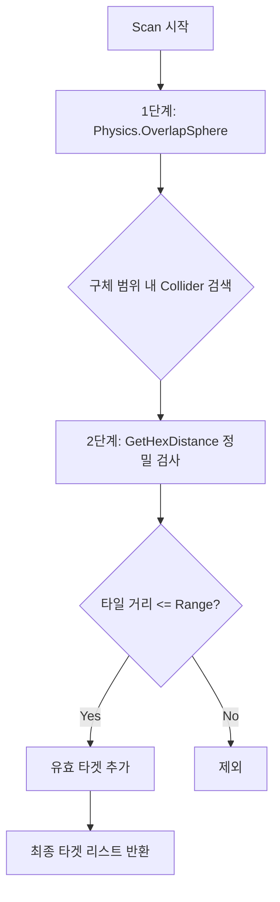
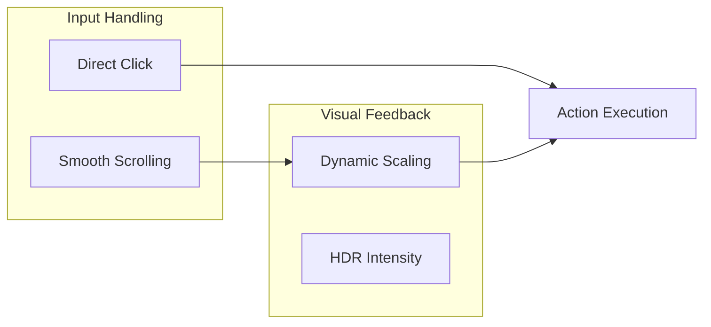

# **[기술 문서] Shapes 및 하이브리드 시스템**

## **1. 개요 (Overview)**
본 문서는 프로젝트의 메인 비주얼 테마를 담당하는 **Shapes** 에셋의 활용 방식과, 이를 기반으로 구축된 **HexGrid(육각 그리드)** 및 **Hybrid UI** 시스템의 기술적 상세 내용을 다룹니다.

---

## **2. Shapes: 메인 비주얼 테마**

### **2.1 Shapes란?**
**Shapes**는 유니티에서 고품질 벡터 그래픽을 렌더링하기 위한 실시간 드로잉 라이브러리입니다. 본 프로젝트에서는 다음과 같은 현실적, 기술적 이유로 Shapes를 핵심 엔진으로 채택했습니다.

*   **1인 개발의 현실적 대안 (Cost-Efficiency):** 1인 개발 환경에서 고퀄리티의 3D 모델이나 텍스처 리소스를 지속적으로 확보하고 관리하는 것은 큰 부담입니다. Shapes는 코드만으로 미려한 비주얼을 생성할 수 있어, 리소스 수급의 한계를 극복하고 시각적 완성도를 높이는 전략적 선택이었습니다.
*   **기술적 도전과 호기심 (Technical Exploration):** 일반적인 프리팹/메쉬 중심의 개발 방식에서 벗어나, GPU의 `Immediate Mode` 드로잉과 벡터 수학을 직접 다루는 방식에 대한 기술적 호기심이 있었습니다. 이를 통해 더 정밀한 렌더링 제어와 최적화 기법을 실무 수준에서 테스트하고 구현하고자 했습니다.
*   **비주얼 정체성 (Why):** 네온 스타일의 사이버펑크 감성을 구현하기 위해 깨지지 않는 매끄러운 벡터 라인과 HDR 글로우(Glow) 효과가 필수적이었습니다.
*   **성능 최적화 (Rationale):** 수백 개의 육각형 타일을 일반 게임 오브젝트로 생성할 때의 오버헤드를 방지하기 위해, 매 프레임 GPU에 직접 그리기 명령을 내려 성능 부하를 최소화했습니다.

---

## **3. HexGrid 시스템: 논리적/시각적 기반**

### **3.1 사각형 그리드(Square Grid)와의 비교 및 장점**

일반적인 사각형 그리드 대신 육각형 그리드를 채택한 이유는 **"거리의 균등성"**과 **"자연스러운 방향성"** 때문입니다.

| 비교 항목 | 사각형 그리드 (Square) | 육각형 그리드 (Hexagon) |
| :--- | :--- | :--- |
| **인접 타일 수** | 4개(상하좌우) 또는 8개(대각선 포함) | **6개 (모든 방향 균등)** |
| **거리 일관성** | 인접 타일(1) vs 대각선 타일($\sqrt{2}$)로 불균일 | **인접한 모든 타일과의 거리가 1로 동일** |
| **이동/범위 형태** | 마름모 또는 정사각형 (비자연적) | **원형에 가까운 정육각형 (자연적)** |
| **회전 자유도** | 90도 단위 | **60도 단위 (더 부드러운 회전)** |

**기술적 이점 (Why):** 
사각형 그리드에서 8방향 이동을 구현할 경우, 대각선 이동 시 피타고라스 정리에 의해 거리가 멀어지는 문제를 해결하기 위한 추가 연산이 필요합니다. 반면, 육각형 그리드는 어느 방향으로 이동하든 타일 간 거리가 일정하여 **범위 판정(AoE)과 이동 로직이 수학적으로 훨씬 단순하고 명확해집니다.**

---

### **3.2 기술적/수학적 이해: Cube 좌표계**

육각형은 평면(2D) 도형이지만, 이를 가장 안정적으로 계산하는 방법은 **3차원 Cube 좌표계($q, r, s$)**를 사용하는 것입니다.

#### **1) 3축 좌표의 원리 ($q + r + s = 0$)**
육각형 그리드의 중심에서 인접 타일로 이동할 때, 한 축이 +1이 되면 다른 축은 반드시 -1이 됩니다. 이 원리에 따라 모든 타일은 **$q + r + s = 0$**이라는 수학적 제약 조건을 만족합니다. 
*   이 제약 조건은 좌표가 그리드를 벗어나거나 비논리적인 위치에 놓이는 것을 방지하는 **"수학적 안전장치"** 역할을 합니다.

#### **2) 타일 거리 계산 (Manhattan Distance in Hex)**
두 타일 사이의 거리는 3개 축의 차이값 중 절댓값 합을 2로 나누어 구합니다.
*   **공식:** $Distance = (|q1-q2| + |r1-r2| + |s1-s2|) / 2$
*   이 방식은 복잡한 삼각함수($sin, cos$)나 제곱근($sqrt$) 연산 없이 **정수 덧셈과 나눗셈만으로 정밀한 거리 산출**을 가능하게 하여 런타임 성능을 극대화합니다.

---

### **3.3 구현된 현재 코드 분석**

이러한 수학적 이론은 `HexGridRenderer.cs`에서 다음과 같이 실무 코드로 구현되어 있습니다.

#### **[좌표 변환] Offset → Cube (L174-L179)**
메모리 효율적인 2차원 배열 형태(Offset)를 연산이 편리한 3축 형태(Cube)로 즉시 변환합니다.
```csharp
private Vector3Int OffsetToCube(int col, int row)
{
    var q = col - (row - (row & 1)) / 2;
    var r = row;
    return new Vector3Int(q, -q - r, r); // y축(-q-r)을 자동 계산하여 q+r+s=0 유지
}
```

#### **[위치 판정] World → Cube (L181-L192)**
유니티의 `Vector3` 월드 좌표를 수학적으로 가장 가까운 육각형 타일 인덱스로 정밀하게 매핑합니다.
```csharp
public Vector3Int WorldToCube(Vector3 worldPos)
{
    int row = Mathf.RoundToInt(worldPos.z / height);
    float xOffset = (row % 2 != 0) ? width * 0.5f : 0f;
    int col = Mathf.RoundToInt((worldPos.x - xOffset) / width);

    return OffsetToCube(col, row);
}
```

#### **[거리 연산] GetHexDistance (L196-L199)**
앞서 설명한 3축 절댓값 합 공식을 사용하여 범위 공격(AoE)의 유효 대상을 판정합니다.
```csharp
public int GetHexDistance(Vector3Int a, Vector3Int b)
{
    return (Mathf.Abs(a.x - b.x) + Mathf.Abs(a.y - b.y) + Mathf.Abs(a.z - b.z)) / 2;
}
```

### **3.3 OverlapHexGrid (ScanTarget)**
특정 범위 내의 적을 감지할 때, 원형 범위를 육각형 타일 단위로 정밀하게 필터링하는 2단계 스캔 방식을 사용합니다.

#### **스캔 로직 순서도**


#### **구현 코드 (ScanTargets)**
```csharp
public List<Collider> ScanTargets(Vector3 centerPos, int range, LayerMask targetLayer)
{
    List<Collider> validTargets = new List<Collider>();

    // 1단계: 성능을 위해 먼저 구체 범위로 물리 검색
    float hexWidth = Mathf.Sqrt(3) * hexRadius;
    float searchRadius = (hexWidth * range) + hexWidth; 
    Collider[] hits = Physics.OverlapSphere(centerPos, searchRadius, targetLayer);

    Vector3Int centerCube = WorldToCube(centerPos);

    // 2단계: 감지된 대상들이 실제 육각형 칸 거리 안에 있는지 정밀 검사
    foreach (var hit in hits)
    {
        Vector3Int hitCube = WorldToCube(hit.transform.position);
        if (GetHexDistance(centerCube, hitCube) <= range)
        {
            validTargets.Add(hit);
        }
    }
    return validTargets;
}
```

---

## **4. 하이브리드 UI (Hybrid UI) 설계**

### **4.1 UI 시스템의 진화 과정**
사용자 경험(UX) 최적화를 위해 두 가지 초기 타입을 거쳐 최종적인 하이브리드 형태에 도달했습니다.

| 단계 | 타입 | 시도 및 문제점 | 해결 방안 (Why) |
| :--- | :--- | :--- | :--- |
| **Step 1** | **단순 스크롤식** | **문제:** 시각적 재미는 있으나, 마우스 정밀 조작 시 답답함 유발. | 조작성 개선 필요 |
| **Step 2** | **순수 클릭식** | **문제:** 정적인 일반 버튼 구조로 인해 사이버펑크 특유의 역동성 결여. | 연출력 보강 필요 |
| **Step 3** | **Hybrid UI** | **결과:** 스크롤의 '동적 연출' + 클릭의 '명확한 입력' 결합. | **최종 채택** |

### **4.2 Hybrid UI의 핵심 메커니즘**
*   **가변 스케일링 (Dynamic Scaling):** 화면 중앙에 가까워질수록 항목의 크기와 광원 강도가 커지는 애니메이션을 통해 시각적 피드백을 제공합니다.
*   **직접 인터랙션 (Direct Interaction):** 스크롤 위치와 상관없이 사용자가 원하는 항목을 즉시 클릭하여 선택할 수 있는 정밀함을 유지합니다.



---

## **5. 사후 가이드 (How to Use)**
### **HexGridRenderer 설정**
1.  `HexGridRenderer` 컴포넌트를 씬의 관리용 오브젝트에 부착합니다.
2.  **Target** 필드에 플레이어 트랜스폼을 할당합니다.
3.  **Color** 및 **Charge Color**를 통해 테마에 맞는 HDR 색상을 설정합니다.

### **차징 및 폭발 효과 호출**
스크립트에서 다음과 같이 시각 효과를 트리거할 수 있습니다.
```csharp
// 1칸 범위, 0.5초 차징 후 콜백 실행
hexGrid.StartCharge(transform.position, 1, 0.5f, targetLayer, (targets) => {
    // 공격 로직 실행
});
```
