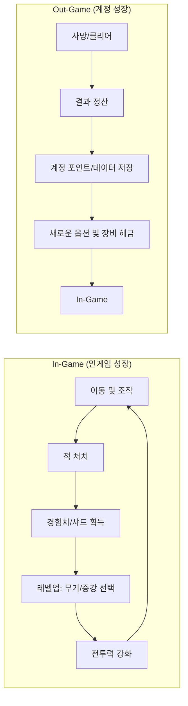

# **[기술 문서] 장르 분석 및 핵심 기획**

## **1. 장르적 정의 및 핵심 철학**
서바이버 로그라이크(Survivor Roguelike) 장르의 본질은 **'성장의 축적'**과 **'물량의 쾌감'**입니다. 본 프로젝트는 이 두 가지 가치를 극대화하기 위해 다음과 같은 설계 원칙을 준수합니다.

### **1.1. 프로젝트 3대 지표 (Core Values)**
*   **확장성 (Scalability)**: 무기와 증강 시스템을 코드 수정 없이 데이터(PureData)만으로 무한히 확장 가능하도록 설계하여 다양한 빌드 조합을 제공합니다.
*   **가시성 (Visibility)**: 육각형 그리드 시스템을 활용하여 복잡한 전투 상황에서도 플레이어가 자신의 공격 범위와 안전 지대를 명확히 인지할 수 있도록 시각적 가이드를 제공합니다.
*   **연속성 (Continuity)**: 단일 세션의 종료가 끝이 아닌, 계정 포인트 시스템을 통해 다음 '판'을 위한 새로운 가능성(옵션 해금 등)으로 이어지는 경험을 제공합니다.

---

## **2. 핵심 메커니즘 (Core Gameplay)**

### **2.1. 조작 및 목표**
*   **단순한 조작**: 플레이어는 **이동**에만 집중하며, 무기는 설정된 로직에 따라 **자동 발사**됩니다.
*   **생존과 성장**: 수백, 수천 마리의 적을 피해 생존하며, 적을 처치하고 얻은 자원을 통해 캐릭터를 실시간으로 강화합니다.
*   **해금 시스템**: 플레이 결과에 따라 새로운 무기, 증강, 시스템 옵션들이 해금되어 계정에 저장됩니다.

### **2.2. 게임 루프 시각화 (Mermaid)**

---

## **3. 성장 시스템 (Farming & Progression)**

### **3.1. 인게임 성장 요소**
*   **경험치**: 적을 처치하고 드롭되는 샤드를 수집하여 레벨업합니다.
*   **무기/스킬 진화**: 레벨업 시 무기를 강화하거나 새로운 스킬을 선택하여 캐릭터의 빌드를 완성합니다.
*   **아이템 및 샤드**: 
    *   **자석 아이템**: 흩어진 샤드를 한 번에 끌어당겨 성장을 가속합니다.
    *   **지속 효과(물약)**: 일시적 혹은 지속적인 버프를 통해 위기 상황을 극복합니다.

### **3.2. 장르적 재미**
*   단순한 파밍을 넘어, 어떤 무기와 증강을 조합하느냐에 따라 매 판 달라지는 **빌드 구성의 재미**를 제공합니다.

---

## **4. 차별화 전략: 모바일 최적화 및 하이브리드 증강**

### **4.1. 모바일 환경을 고려한 호흡 재설계**
*   **스테이지 구조**: 기존 PC 기반 장르의 30분 단위 게임 플레이를 모바일 환경에 맞춰 **5분 단위 스테이지 반복** 구성으로 변경했습니다.
*   **목표**: 짧은 세션 속에서도 로그라이크 특유의 성장 피드백을 압축적으로 체감할 수 있도록 설계했습니다.

### **4.2. 심화된 증강 시스템 (Augment System)**
단순 스탯 강화를 넘어 게임 플레이의 양상을 바꾸는 '증강'을 세분화하여 제공합니다.

| 분류 | 특징 | 세부 예시 |
| :--- | :--- | :--- |
| **캐릭터 증강** | 캐릭터 본체에 적용되는 메카니즘 변화 | 명중 시 추가 효과, 처치 시 버프 발생 등 |
| **저주 받은 증강** | 하이리스크 하이리턴 (강력한 패널티 수반) | 공격력 대폭 증가 / 최대 체력 감소 등 |
| **장비 종속형 증강** | 소지한 특정 장비에 변화를 주는 증강 | 특정 장비 외 제거 후 해당 장비 극단적 강화 |

### **4.3. 성장 밸런스 설계 의도**
계정 성장과 인게임 성장의 역할을 명확히 구분하여 '실력과 전략'의 가치를 보존합니다.

*   **계정 성장 (Meta Progression)**: 플레이어의 직접적인 전투 스탯 상승은 최대한 절제합니다.
    *   **편의성**: 리롤(Reroll) 횟수 추가, 자석 범위 증가, 경험치 획득량 보정.
    *   **다양성**: 새로운 무기 및 변이 장비 해금.
*   **인게임 성장 (In-game Progression)**: 실제 전투력의 **80~90%**는 해당 판에서의 선택과 빌드 구성에 의해 결정되도록 설계하여 매 판 새로운 전략적 도전을 유도합니다.
