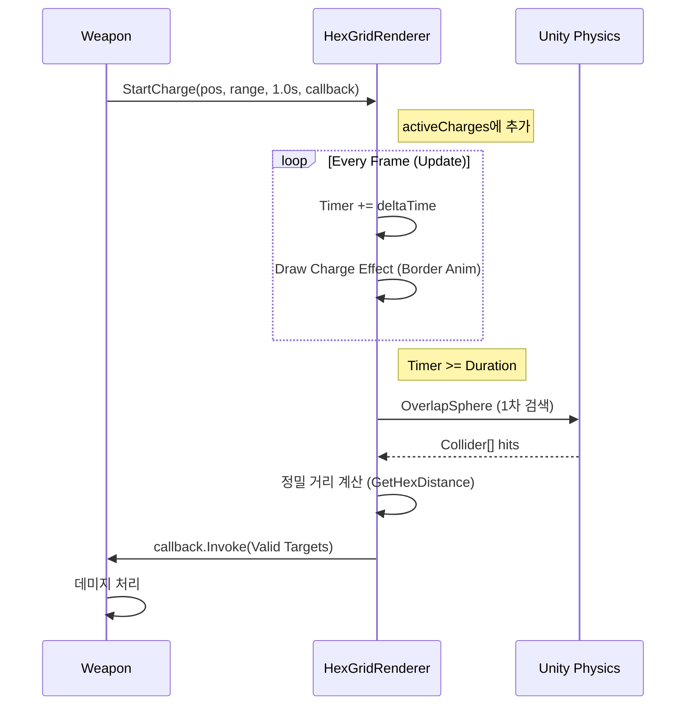

# [기술문서] HexGridRenderer 시스템

## 1. 개요 (Overview)
`HexGridRenderer`는 **Shapes** 라이브러리의 `Immediate Mode`를 기반으로 작동하는 육각형 그리드 렌더링 및 로직 처리 시스템입니다. 단순한 배경 장식을 넘어, 타일 기반의 거리 계산, 범위 판정(AoE), 비동기 공격(차징) 시각화 기능을 제공합니다.

*   **스크립트 위치**: `Assets/02.Scripts/ShapesWork/Grid/HexGridRenderer.cs`
*   **주요 역할**: 그리드 렌더링, 좌표 변환(World ↔ Hex), 타겟 감지

## 2. 좌표계 시스템 (Coordinate System)
이 시스템은 두 가지 좌표계를 혼용하여 사용합니다.

1.  **Offset Coordinates (Odd-R)**:
    *   **형태**: `(col, row)`
    *   **용도**: 유니티 월드 좌표를 2차원 배열 인덱스로 변환하거나, 화면에 육각형을 배치할 위치를 계산할 때 사용합니다.
    *   **특징**: 홀수 행(Odd Row)이 오른쪽으로 반 칸(`width * 0.5`) 밀려있는 구조입니다.

2.  **Cube Coordinates**:
    *   **형태**: `(q, r, s)` 단, `q + r + s = 0`
    *   **용도**: 육각형 간의 **거리 계산**, **범위 순회** 등 수학적 정밀함이 필요한 로직에 사용합니다.
    *   **특징**: 3개의 축이 120도 간격으로 배치되어 있어 모든 방향으로의 이동 비용이 동일하게 계산됩니다.

```mermaid
graph TD
    World[World Position (x,y,z)] -->|WorldToCube| Cube[Cube Coord (q,r,s)]
    Cube -->|GetHexDistance| Distance[Distance (Int)]
    Cube -->|CubeToOffset| Offset[Offset Coord (col,row)]
    Offset -->|Draw.RegularPolygon| Rendering[Screen Rendering]
```

---

## 3. 주요 함수 상세 설명 (Function Details)

### 3.1 좌표 변환 및 거리 계산

#### `OffsetToCube(int col, int row)`
*   **설명**: 2차원 배열 형태의 Offset 좌표를 수학적 계산을 위한 Cube 좌표로 변환합니다.
*   **입력**: `col` (열), `row` (행)
*   **출력**: `Vector3Int` (q, r, s) - s는 z컴포넌트에 저장하지 않고 `r`을 z에 저장함 (`new Vector3Int(q, -q-r, r)`).
*   **로직**: 홀수 행의 오프셋 보정을 제거하고 3축 좌표로 매핑합니다.

#### `CubeToOffset(Vector3Int cube)`
*   **설명**: Cube 좌표를 다시 렌더링을 위한 Offset 좌표로 변환합니다.
*   **입력**: `cube` (q, r, s)
*   **출력**: `Vector2Int` (col, row)
*   **용도**: `activeCharges` 루프에서 정확히 계산된 타일의 월드 위치를 찾을 때 사용됩니다.

#### `WorldToCube(Vector3 worldPos)`
*   **설명**: 유니티 월드 좌표(Vector3)가 어떤 육각형 타일 위에 있는지 계산합니다.
*   **과정**:
    1.  육각형의 높이(`height`)를 기준으로 `row`를 구합니다.
    2.  `row`가 홀수인지 짝수인지에 따라 X축 오프셋을 적용합니다.
    3.  너비(`width`)를 기준으로 `col`을 구합니다.
    4.  `OffsetToCube`를 호출하여 최종 반환합니다.

#### `GetHexDistance(Vector3Int a, Vector3Int b)`
*   **설명**: 두 육각형 타일 사이의 최소 이동 횟수(거리)를 반환합니다.
*   **공식**: `(|a.q - b.q| + |a.r - b.r| + |a.s - b.s|) / 2` (맨해튼 거리의 육각형 버전)

---

### 3.2 게임 로직 및 감지

#### `IsPositionInAoE(Vector3 targetPos)`
*   **설명**: 특정 월드 좌표가 중심(Target)으로부터 설정된 범위(`aoeRange`) 내에 있는지 확인합니다.
*   **반환**: `true` / `false`

#### `ScanTargets(Vector3 centerPos, int range, LayerMask targetLayer)`
*   **설명**: 지정된 위치 주변의 적(Collider)을 정밀하게 탐색합니다.
*   **최적화 로직**:
    1.  **1차 필터링**: `Physics.OverlapSphere`를 사용하여 대략적인 범위 내의 모든 충돌체를 가져옵니다. (빠름)
    2.  **2차 필터링**: 가져온 충돌체들의 위치를 `WorldToCube`로 변환하여, 중심점과의 육각 거리가 `range` 이하인 것만 골라냅니다. (정확함)
*   **반환**: `List<Collider>`

---

### 3.3 차징 및 시각화

#### `StartCharge(Vector3 center, int range, float duration, LayerMask layer, Action<List<Collider>> onComplete)`
*   **설명**: 비동기 공격(차징)을 시작합니다.
*   **매개변수**:
    *   `center`: 공격 중심점
    *   `range`: 공격 범위 (육각 칸 수)
    *   `duration`: 차징 소요 시간 (초)
    *   `onComplete`: 시간이 완료된 후 실행될 콜백 함수 (감지된 적 리스트를 인자로 받음)
*   **동작**: 내부 리스트 `activeCharges`에 인스턴스를 추가하고 `Update` 문에서 타이머를 돌립니다.

#### `DrawShapes(Camera cam)`
*   **설명**: Shapes 라이브러리의 메인 렌더링 루프입니다. `ExecuteAlways`로 인해 에디터에서도 실행됩니다.
*   **주요 로직**:
    1.  **기본 그리드 그리기**: `target`을 중심으로 `viewDistance` 혹은 `aoeRange`만큼 타일을 그립니다.
    2.  **차징 이펙트 그리기**: `activeCharges` 리스트를 순회하며 진행 중인 공격을 그립니다.
        *   **Cube Loop**: `q, r` 이중 루프를 사용하여 중심에서 N칸 거리 내의 모든 타일을 빠짐없이 순회합니다.
        *   **Visual Effect**: `Draw.RegularPolygonBorder`를 사용하여 테두리가 안쪽으로 두꺼워지는(Border-to-Center) 애니메이션을 표현합니다.
        *   **Z-Test**: `CompareFunction.Always`를 사용하여 배경이나 장애물 위에 항상 표시되도록 합니다.



## 4. 인스펙터 설정 가이드

*   **Grid Mode**:
    *   `Background`: 플레이어 주변에 넓게 배경을 깝니다.
    *   `AoE`: 플레이어 주변 `AoE Range`만큼만 그립니다. (무기 범위 표시에 적합)
*   **AoE Settings**:
    *   `AoE Range`: 물리적 거리가 아닌 **칸 수**입니다. (1 = 주변 1칸 포함 총 7칸)
*   **Render Settings**:
    *   `Z Test`: `Always`로 설정하면 바닥이나 벽을 뚫고 보입니다.
    *   `Render Pass Event`: UI 등과의 겹침 문제를 해결하기 위해 렌더링 순서를 조절합니다.
