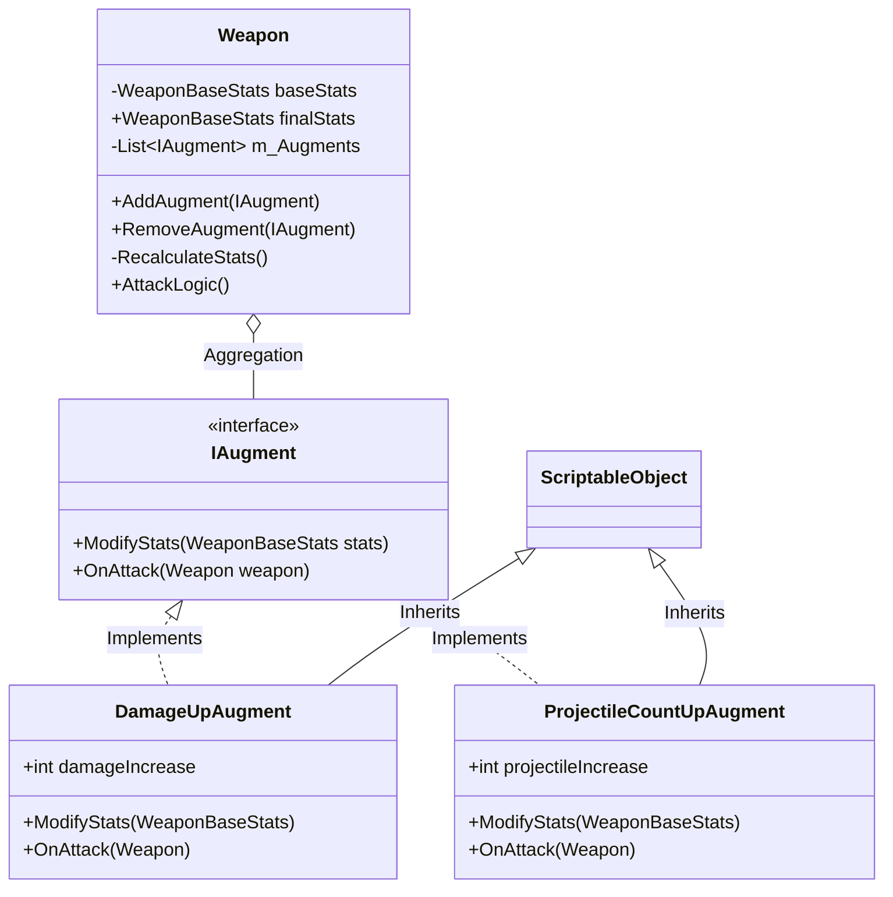

# 증강 시스템 (Augment System) 사용설명서

## 1. 개요
증강 시스템은 게임 내 무기(Weapon)의 성능을 동적으로 강화하거나 특수한 효과를 부여하기 위해 설계된 시스템입니다. `ScriptableObject`를 기반으로 설계되어 있어, 에디터 상에서 데이터를 손쉽게 관리하고 새로운 증강을 빠르게 추가할 수 있습니다.

## 2. 주요 구성 요소

### 2.1 IAugment 인터페이스
모든 증강 기능의 기본이 되는 인터페이스입니다.
```csharp
public interface IAugment
{
    // 무기의 스탯(데미지, 투사체 수 등)을 변경할 때 호출됩니다.
    void ModifyStats(WeaponBaseStats stats);

    // 무기가 공격을 수행할 때마다 호출됩니다. (특수 효과 발동 등에 사용)
    void OnAttack(Weapon weapon);
}
```

### 2.2 Weapon 클래스 내 연동
`Weapon` 클래스는 증강 리스트를 관리하며, 증강이 추가되거나 제거될 때마다 스탯을 재계산합니다.

*   **AddAugment(IAugment augment)**: 증강을 리스트에 추가하고 스탯을 재계산합니다.
*   **RecalculateStats()**: 기본 스탯(`baseStats`)에서 시작하여 모든 증강의 `ModifyStats`를 순차적으로 실행해 최종 스탯(`finalStats`)을 도출합니다.
*   **AttackLogic()**: 공격 시 모든 증강의 `OnAttack`을 호출합니다.

## 3. 새로운 증강 만들기

새로운 증강 효과를 만들려면 다음 단계를 따르세요.

### 3.1 스크립트 작성
1. `ScriptableObject`와 `IAugment`를 상속받는 클래스를 생성합니다.
2. `ModifyStats`와 `OnAttack` 메서드를 구현합니다.
3. `[CreateAssetMenu]` 속성을 추가하여 에디터에서 생성 가능하게 만듭니다.

**예시 코드 (공격 속도 증가 증강):**
```csharp
using UnityEngine;

[CreateAssetMenu(fileName = "New AttackSpeedAugment", menuName = "Augments/Attack Speed Augment")]
public class AttackSpeedAugment : ScriptableObject, IAugment
{
    [Tooltip("감소시킬 쿨타임 비율 (0.1 = 10% 감소)")]
    public float cooldownReduction = 0.1f;

    public void ModifyStats(WeaponBaseStats stats)
    {
        // 쿨타임을 감소시켜 공격 속도를 높임
        stats.cooldown *= (1f - cooldownReduction);
    }

    public void OnAttack(Weapon weapon)
    {
        // 공격 시 별도 효과 없음
    }
}
```

### 3.2 에셋 생성
1. Unity 에디터의 Project 창에서 우클릭합니다.
2. `Create > Augments > [작성한 증강 이름]`을 선택하여 에셋을 생성합니다.
3. Inspector 창에서 수치를 설정합니다.

## 4. 구조 다이어그램
다음은 증강 시스템의 클래스 구조도입니다.



## 5. 주의사항
*   **스탯 재계산 비용**: `AddAugment`나 `RemoveAugment` 호출 시마다 스탯 전체를 재계산하므로, 매 프레임 호출하는 것은 피해야 합니다.
*   **스탯 적용 순서**: 리스트에 추가된 순서대로 `ModifyStats`가 호출됩니다. 곱연산과 합연산이 섞여 있을 경우 적용 순서에 따라 결과가 달라질 수 있음을 유의하세요.
