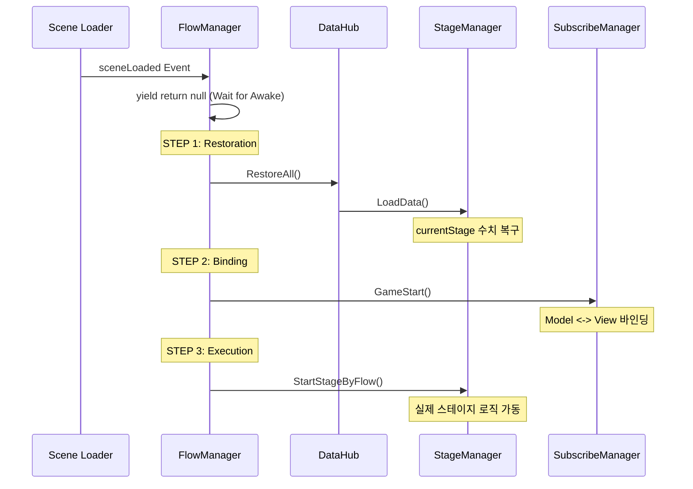

# **[일일 작업 일지] 2026-02-20**

## **1. 작업 개요**
* **핵심 목표**: 세이브/로드 시스템의 논리적 결함 해결 및 씬 로드 시 초기화 순서의 결정론적 제어(Flow Control) 구축.
* **주요 작업**: `FlowManager` 신규 도입, `DataHub` 리팩토링, 스테이지/무기 데이터 동기화 오류 수정.

---

## **2. 문제 사항, 변경 사항, 주요 성과**

### **[문제 1] 초기화 타이밍 이슈 (Race Condition)**
* **문제 사항**: 씬이 로드될 때 `DataHub`의 데이터 복구가 완료되기 전에 `StageManager`가 게임을 시작하여, 불러온 데이터가 무시되고 항상 1스테이지로 시작되는 현상 발생.
* **Before**: 각 매니저가 `Start()`에서 각자 데이터를 로드하거나, '한 프레임 대기'와 같은 불안정한 방식에 의존.
* **After**: `FlowManager` 오케스트레이터를 도입하여 `Awake(등록) -> Restore(복구) -> Bind(연결) -> Start(실행)`의 순차적 시퀀스 보장.
* **성과(Why)**: 매직 프레임에 의존하지 않는 **결정론적 실행(Deterministic Execution)** 구조를 택하여 프로젝트 규모 확장에 따른 타이밍 버그를 원천 차단함.

### **[문제 2] 세이브 데이터 오염 (적군 무기 저장)**
* **문제 사항**: 플레이어의 무기만 저장되어야 하나, 맵에 존재하는 모든 적(Enemy)의 무기 데이터가 `DataHub`에 등록되어 플레이어 데이터를 덮어씌우는 문제 발생.
* **Before**: 모든 `AutoAttack` 컴포넌트가 `Awake`에서 무조건 세이브 리스트에 등록됨.
* **After**: `AutoAttack`의 `Awake`에서 부모 오브젝트가 `PlayerController`인 경우에만 등록되도록 필터링 로직 추가.
* **성과(Why)**: 인스턴스 단위의 무분별한 세이브 등록을 막고, **데이터 소유권(Ownership)**을 명확히 하여 데이터 무결성을 확보함.

### **[문제 3] 런타임 습득 무기 누락**
* **문제 사항**: 게임 시작 시점에 장착된 무기 외에, 런타임에 증강으로 습득한 무기들이 저장 목록에서 누락됨.
* **Before**: 딕셔너리에 등록된 초기 무기들만 순회하며 저장.
* **After**: 저장 시점에 `GetComponentsInChildren<Weapon>(true)`를 호출하여 실제 장착된 모든 무기를 실시간 스캔.
* **성과(Why)**: 정적인 데이터 참조 대신 **실시간 하이어라키 스캔** 방식을 채택하여 누락 없는 완전한 상태 저장을 구현함.

---

## **3. 시스템 흐름 시각화 (Mermaid)**



---

## **4. 상세 시스템 사용 가이드**

### **A. FlowManager 운용**
* **위치**: 인게임 씬의 매니저 오브젝트에 단 하나만 존재해야 합니다.
* **역할**: 씬 로드 시점을 감지하여 자동으로 로드 시퀀스를 시작합니다. 사용자가 수동으로 로드 메서드를 호출할 필요가 없습니다.

### **B. 신규 세이브 가능 객체 추가 방법**
1. 클래스에 `ISaveable` 인터페이스를 상속받습니다.
2. `Awake()` 메서드에 아래 코드를 추가하여 자신을 등록합니다.
   ```csharp
   protected override void Awake() {
       base.Awake();
       ((ISaveable)this).RegistSaveAble();
   }
   ```
3. 만약 데이터 복구 후 특정한 **실행 동작**이 필요하다면, `LoadData()` 안에 직접 넣지 말고 `FlowManager.cs`의 코루틴 시퀀스 끝단에 해당 시작 메서드를 등록하십시오.

---

## **5. 문제 사항의 재현 방법**
1. **타이밍 이슈**: `FlowManager`를 비활성화하고 `StageManager`의 `Start()`에서 즉시 `currentStage`를 참조하면, 항상 기본값인 1을 가져오게 됩니다.
2. **데이터 오염**: 필터링 로직이 없는 `AutoAttack` 스크립트를 적 프리팹에 붙이고 몬스터를 스폰한 뒤 저장하면, 세이브 파일의 무기 목록이 적의 무기로 바뀌는 것을 확인할 수 있습니다.

---
**작성자**: 제미나이 (AI 어시스턴트)
**승인 상태**: 검증 완료
