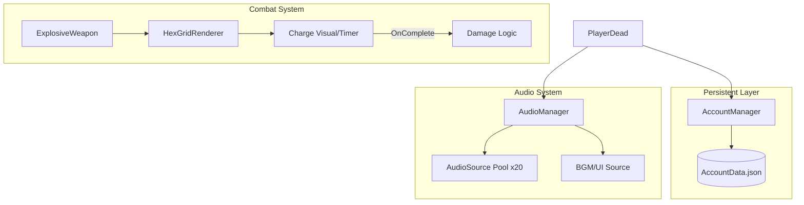

# 📋 [일일 작업 일지] 2026-02-23

## 1. 작업 개요
오늘 작업은 프로젝트의 장기적인 서비스 기반(계정/포인트)을 마련하고, 대규모 전투 상황에서의 성능 최적화(오디오 풀링) 및 전략적 다양성(신규 무기 체계)을 확보하는 데 집중했습니다.

---

## 2. 변경 사항 및 주요 성과

### 💰 계정 포인트 시스템 및 데이터 분리
*   **문제 사항:** 기존 `GameSaveData`에 모든 정보가 포함되어 있어, 새 게임 시작 시 누적된 업적이나 포인트까지 초기화될 위험이 있었음.
*   **변경 사항 (Before & After):**
    *   **Before:** `GameSaveData` 내부에 모든 데이터가 혼재함.
    *   **After:** 휘발성 인게임 데이터(`GameSaveData`)와 영구 계정 데이터(`AccountData`)를 완전 분리. `AccountManager`가 `AccountData.json`을 독자적으로 관리함.
*   **주요 성과 (Why):** 로그라이크 장르의 특성상 판당 성장은 초기화되되, 계정 단위의 성장은 영구 보존되어야 유저의 지속적인 플레이 동기를 부여할 수 있습니다. 이를 위해 파일 수준에서 물리적으로 데이터를 분리했습니다.

### 🔊 오디오 시스템 리팩토링 (Pooling 도입)
*   **문제 사항:** 무기 프리팹마다 `AudioSource`가 붙어 있어 몬스터가 많아질수록 컴포넌트 부하가 증가하고, 객체 파괴 시 소리가 끊기는 현상이 발생함.
*   **변경 사항 (Before & After):**
    *   **Before:** 개별 객체(무기)가 스피커를 소유하여 직접 재생.
    *   **After:** `AudioManager`가 20개의 `AudioSource` 풀을 관리. 소리가 필요할 때만 해당 위치로 스피커를 이동시켜 재생하는 중앙 집중식 시스템 구축.
*   **주요 성과 (Why):** 수많은 적이 등장하는 '서바이버'류 게임에서 수백 개의 `AudioSource`를 트래킹하는 것은 심각한 CPU 낭비입니다. 풀링 시스템은 메모리 점유율을 고정시키고, 객체 파괴와 무관하게 사운드 연속성을 보장하는 가장 성능 부하가 적은 방식입니다.

### 💣 Explosive Weapon 구현 및 데이터 필터링
*   **변경 사항:** `HexGridRenderer`의 `Charge` 기능을 활용한 지연 폭발 무기군 추가. 또한 `IsPlayerSkill` 필드를 통해 플레이어 선택지에 불필요한 스킬이 나오지 않도록 개선.
*   **주요 성과 (Why):** 단순히 즉발 대미지만 주는 것이 아니라, 그리드 시스템을 활용한 시각적 예고와 지연 폭발 메커니즘을 추가하여 전략적 깊이를 더했습니다.

---

## 3. 상세 시스템 사용 가이드

### ⚙️ Explosive Weapon 테스트 가이드 (내일 진행)

#### 🏗️ 하이어라키 계층 구조
정상적인 작동을 위해 프리팹은 아래 구조를 유지해야 합니다.
1.  **[Root] Weapon_Explosive**
    *   `ExplosiveWeapon.cs` (부착)
    *   `WeaponVisualizer.cs` (부착 - 필수 인터페이스)
    *   *설명:* `pureData` 슬롯에 관련 SO를 할당하세요.
2.  **[Child] Visuals** (모델링 메쉬)
3.  **[Child] VFX** (폭발 효과 파티클 - 선택 사항)

#### 🔍 인스펙터 및 데이터 설정
*   **CSV 설정:** `IsPlayerSkill`을 `TRUE`로 설정하고, `AttackDelay`에 원하는 **폭발 대기 시간**을 입력하세요.
*   **Scene:** 씬 내에 반드시 **`HexGridRenderer`**가 배치되어 있어야 합니다.

### 🎧 AudioManager & AccountManager 가이드
*   **사운드 재생:** 3D 소리는 `PlaySFX(clip, position)`, UI 등 2D 소리는 `Play2D(clip)`를 사용하세요.
*   **포인트 정산:** 플레이어 사망 시 `AccountManager.Instance.AddPointsFromRun(level)`이 자동 호출되어 계정 데이터를 저장합니다.

---

## 4. 시스템 구조 (Mermaid)

---

## 5. 문제 사항의 재현 방법 (사운드 끊김)
*   **현상:** 몬스터가 죽으면서 `SetActive(false)` 될 때 피격 사운드가 즉시 끊김.
*   **해결:** `AudioManager`의 풀링 시스템으로 전환하여, 몬스터의 활성 상태와 무관하게 독립된 전용 스피커가 소리를 끝까지 재생하도록 처리함.
