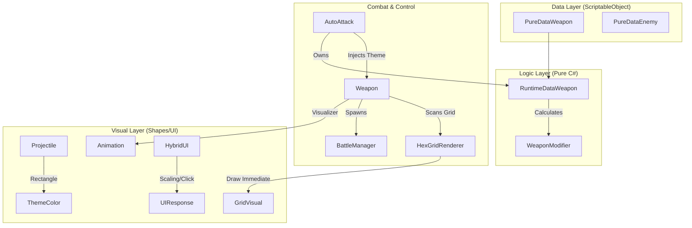
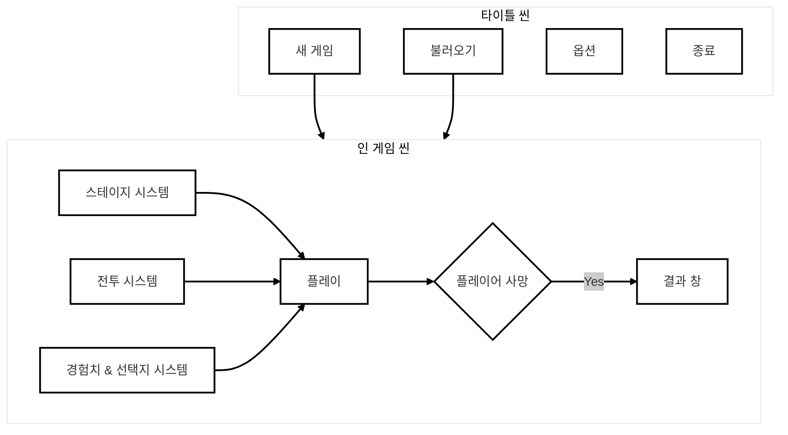
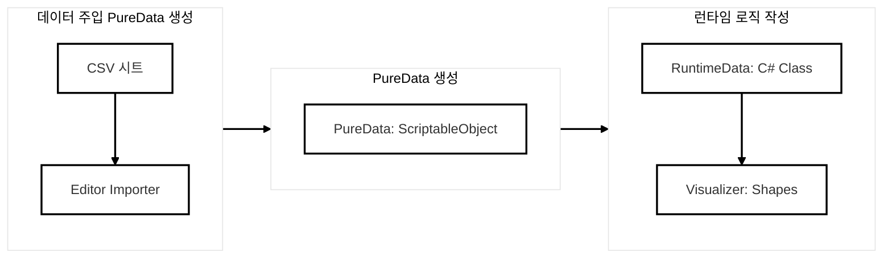

# **[프로젝트 통합 기술 문서] 프로젝트 아키텍처 진화 및 핵심 시스템 통합 요약**

## **1. 개요**
본 문서는 '3D Vampire Survivor-Like' 프로젝트의 개발 중기 기술적 변천사를 기록합니다. 초기 프로토타입에서 현재의 고도화된 데이터 중심 설계(DLV) 및 그리드 기반 전투 시스템으로 진화한 과정을 **[시도 - 문제 - 해결]**의 논리로 해설합니다.

---

## **2. 시스템 진화 Timeline**

### **Phase 1: 초기 구조 및 프로토타이핑**
*   **시도:** 유니티의 기본 컴포넌트(MonoBehaviour) 중심으로 로직과 데이터를 혼재하여 구현.
*   **문제:** 무기 종류 증가에 따른 스탯 관리의 한계 및 대규모 전투 시 사운드/성능 최적화 문제 발생.
*   **해결:** 데이터와 로직을 물리적으로 분리하는 **DLV 아키텍처** 설계 착수.

### **Phase 2: DLV(Data-Logic-Visual) 아키텍처 현대화**
*   **시도:** 모든 무기 성능을 코드에서 분리하여 `ScriptableObject`로 관리.
*   **문제:** 원본 데이터(PureData)를 직접 수정할 경우 런타임 중 영구적인 변질 위험 발생.
*   **해결 (Why):** 순수 C# 클래스인 `RuntimeData`를 매개체로 사용하여 증강(Modifier) 연산을 수행. 이는 데이터 무결성을 보장하며 기획 수치를 CSV로 일괄 임포트할 수 있는 기반이 됨.

### **Phase 3: 그리드 기반 전투 및 Shapes 시스템 통합**
*   **시도:** 원형 콜라이더 기반의 단순 AoE(범위 공격) 구현.
*   **문제:** 육각형 그리드 배경과의 시각적 불일치 및 정밀한 타일 단위 공격 판정의 부재.
*   **해결 (Why):** **HexGridRenderer** 도입 및 `Shapes` 라이브러리의 `Immediate Mode` 활용. 매 프레임 GPU에 직접 그리기 명령을 내려 성능 부하를 최소화하면서도, 육각형 타일별 개별 폭발 연출을 통해 프로젝트 고유의 시각적 정체성을 확립함.

### **Phase 4: 동적 테마 시스템 및 의존성 주입**
*   **시도:** 무기 프리팹에 고정된 색상 값을 할당.
*   **문제:** 플레이어와 적의 공격 구분이 모호하며, 런타임 중 시각 효과의 유연한 변경이 불가능함.
*   **해결 (Why):** **의존성 주입(DI)** 개념을 활용한 테마 시스템 구축. 주체(`AutoAttack`)가 `VisualTheme`을 소유하고 무기에 전달함으로써 코드 결합도를 낮추고 재사용성을 극대화함.

### **Phase 5: 하이브리드 UI 시스템의 진화와 사용자 경험(UX) 최적화**
*   **시도 1 (단순 스크롤식):** 리스트를 스크롤하여 화면 중앙에 가장 가까운 버튼이 자동으로 선택되는 방식 도입.
    *   **문제:** 시각적 재미는 있으나, 마우스 정밀 조작이 필요한 환경에서 조작의 답답함(Lack of Precision) 유발.
*   **시도 2 (순수 클릭식):** 모든 항목을 일반적인 버튼으로 구성하여 클릭 즉시 선택되도록 변경.
    *   **문제:** 프로젝트 특유의 네온/사이버펑크 감성이 주는 역동적인 애니메이션 피드백이 사라져 시각적 만족도 저하.
*   **해결 (Why - 하이브리드 타입):** 스크롤의 **'동적인 연출'**과 클릭의 **'명확한 입력'**을 결합한 하이브리드 시스템 구축. 가변 스케일링을 통한 중앙 강조와 직접 클릭 인터랙션을 통합하여 시각적 만족도와 조작 편의성을 동시에 확보함.

---

## **3. 핵심 아키텍처 구조 (Mermaid)**

---

## **4. 주요 기술적 의사결정 근거 (Rationale)**

| 핵심 기술 | 채택 이유 (Why) | 기대 효과 |
| :--- | :--- | :--- |
| **DLV 패턴** | 데이터와 로직의 완전한 독립성 확보 | 기획 수치 대량 수정 및 증강 시스템의 안정적 확장 |
| **Shapes Immediate Mode** | 대규모 그리드 렌더링 최적화 | 오브젝트 오버헤드 없는 타일 단위 정밀 연출 |
| **Theme Injection** | 주체 중심의 시각 정보 결정 방식 | 플레이어/적 구분 명확화 및 런타임 연출 유연성 |
| **Hybrid UI** | 연출력과 조작성(Precision)의 결합 | 다양한 입력 장치 대응 및 고퀄리티 UX 제공 |
| **Audio Pooling** | 사운드 리소스 효율 관리 | 객체 파괴와 무관한 사운드 연속성 보장 및 부하 감소 |

---

## **5. 주요 프로세스 시각화 (Detailed Flows)**

### **5.1 게임 런타임 사이클 (Game Loop)**
유저가 게임을 시작하여 종료하기까지의 전 과정입니다.

### **5.2 개발자 워크플로우 (Development Pipeline)**
새로운 콘텐츠(무기/몬스터)를 추가하는 개발 과정입니다.

